# DATA 266 Lab 1 Report — LLM, Sentiment Classification, CycleGAN

**Team 42** — Anushka Rajesh Khadatkar (Member A) and Nikhil Khaneja (Member B), Fall 2026
**Repository:** https://github.com/Nikhil-Khaneja/llm-sentiment-cyclegan-lab
**Kaggle team:** `PairProgramming_Team_42` (competition `data-266-fall-2026-gan-image-style-transfer`)

> Paths below are relative to the repository root; images are linked relative to `report/`. Every number is traceable to a file named next to it. Items that depend on people (manual error annotations) are marked **PENDING** and are not filled in with invented values.

---

## 1. Team ownership statement

Each member independently designed, coded and trained their own model for all three tasks, with their own architecture, hyperparameters, folders, checkpoints, logs and `results.md`; nothing is copied between members. **Anushka (Member A)** built a 6-block × 6-head character Transformer (10.93M parameters, 512-character context), a mean-pool / CNN (k=3,4,5) / BiGRU sentiment lineup, and a 64-channel CycleGAN trained at 256 px. **Nikhil (Member B)** built a 2-block × 8-head character Transformer (1.65M parameters, 128-character context), a last-token / CNN (k=7) / BiLSTM-with-attention sentiment lineup, and a 32-channel CycleGAN trained at 128 px. The team's best Kaggle score (−48.6479, team rank 21 on 6 Oct 2026) is Anushka's submission; Nikhil's own submission scored −54.2222. The two designs differ in architecture and hyperparameters in every task (side-by-side tables in §3–§5). The joint-analysis subsections are written from the fact sheet `report/joint_analysis_fact_sheet.md`.

## 2. Evidence index

| Evidence | Anushka | Nikhil |
|---|---|---|
| Task 1 code / config / results | `task1_llm/member_anushka/` (`src/Part1_LLM.ipynb`, `src/config.json`) | `task1_llm/member_nikhil/` (`src/task1_gpt_nikhil.ipynb`, `src/configs/gpt_nikhil_B.yaml`) |
| Task 2 code / config / results | `task2_sentiment/member_anushka/` | `task2_sentiment/member_nikhil/` (`src/configs/sentiment_nikhil_B.yaml`) |
| Task 3 code / config / results | `task3_gan/member_anushka/` | `task3_gan/member_nikhil/` (`src/configs/cyclegan_nikhil_B.yaml`) |
| Checkpoints | `…/member_anushka/checkpoints/` | `…/member_nikhil/checkpoints/` |
| Manifests | `reproducibility/manifests/task*_anushka_*` | `reproducibility/manifests/nikhil/` |
| Raw logs | `reproducibility/raw_logs/task*_anushka/` | `reproducibility/raw_logs/nikhil/` |
| Metrics / failure analysis | each folder's `metrics_report.csv` (Task 3: `full_metrics_report.csv`), `failure_analysis.md`, `results.md` | same |

**Checkpoint → result mapping (final runs).**

| Result | Checkpoint / run ID |
|---|---|
| Nikhil Task 1 | `task1_llm/member_nikhil/checkpoints/gpt_nikhil_2L8H_B_20261001-0025_best.pt` |
| Nikhil Task 2 (B1/B2/B3) | `task2_sentiment/member_nikhil/checkpoints/sentiment_nikhil_B_20260929-1913_{B1_baseline_lasttoken,B2_cnn_k7,B3_bilstm_attn}.pt` |
| Nikhil Task 3 | `task3_gan/member_nikhil/checkpoints/cyclegan_nikhil_r9c32_B_20261001-0022_epoch050.pt` |
| Anushka Task 1 | `task1_llm/member_anushka/checkpoints/best_model.pt` (run `20260929_225852`); baseline `baseline_seq256_best_model.pt` |
| Anushka Task 2 | three checkpoints under `task2_sentiment/member_anushka/` (see its README) |
| Anushka Task 3 | `task3_gan/member_anushka/outputs/full_run_20261001_222745/` |

Extra, non-submission runs: Nikhil's `cyclegan_nikhil_r6c64_20260929-2039` (a 6-block/64-channel model trained by mistake, explained in `task3_gan/member_nikhil/MEMBER_A_RUN_NOTE.md`) and a 4-layer/4-head Task 1 run (`gpt_nikhil_4L4H_20260925-1737`); smoke tests are logged separately. Anushka's stopped Task 3 runs are listed in her `failure_analysis.md`.

**Reproduce one run with one command** (Nikhil Task 1 smoke test; the full 12-epoch run is the same command with `gpt_nikhil_B.yaml`, about 4 minutes on an RTX 5090):

```bash
python task1_llm/member_nikhil/src/train.py --config task1_llm/member_nikhil/src/configs/smoke_B.yaml
```

Setup, dataset download and the Task 2 / Task 3 commands are in the root `README.md`.

---

## 3. Task 1 — Character-level GPT from scratch

Both models use hand-written causal multi-head self-attention, learned token and position embeddings, pre-LayerNorm blocks with residual connections, and an LM head. No `nn.Transformer` or `MultiheadAttention` is used. Both use the same 100,000 / 10,000 TinyStories split sizes [2]; architecture follows [1].

### 3.1 Architecture and hyperparameters

| Item | Nikhil (B) | Anushka (A) |
|---|---|---|
| Blocks / heads | 2 / 8 (head dim 32) | 6 / 6 |
| d_model / FFN / dropout | 256 / 1,024 / 0.10 | 384 / 1,536 / 0.15 |
| Context / vocabulary | 128 chars / 80 | 512 chars / 107 |
| Optimizer | AdamW, lr 2.5e-4, wd 0.01 | AdamW, lr 6e-4, wd 0.1 |
| Schedule | 500 warm-up steps, cosine to 1e-5 | 800 warm-up steps, cosine to 3e-5 |
| Batch / epochs / clip | 64 / 12 / 1.0 | 128 / 20 / 1.0 |
| Generation | temperature 0.9 and greedy | temperature 0.8 and greedy |
| Seed / hardware | 1337 / RTX 5090 | 3963 / RTX 5090 |

### 3.2 Metrics (all required metrics, both members)

| Metric | Nikhil (B) | Anushka (A) |
|---|---|---|
| Parameters | 1,653,840 | 10,926,443 |
| Train / val cross-entropy | 0.8242 / 0.8440 | 0.5252 / 0.5651 |
| Val perplexity / bits-per-char | 2.326 / 1.218 | 1.760 / 0.815 |
| Train / val top-1 accuracy | 73.69% / 73.20% | 83.11% / 82.01% |
| Generalization gap (val − train CE) | 0.0198 | 0.0399 |
| Distinct-1 / 2 / 3 | 0.313 / 0.771 / 0.921 (T=0.9) | 0.107 / 0.489 / 0.778 |
| Repeated 4-gram rate | 0.000 (T=0.9) / 0.260 (greedy) | 0.102 |
| Mean / max grad norm | 0.757 / 6.71 | 0.201 / 2.26 |
| Non-finite steps / loss spikes | 0 / 0 | 0 / not recorded |
| Train / generation tokens/s | 759,303 / 314 (greedy) | 399,476 / 597 (greedy) |
| Peak memory / training time | 541 MB / 211 s | 14,805 MB / 2,573 s |

Evidence — Nikhil: `task1_llm/member_nikhil/outputs/gpt_nikhil_2L8H_B_20261001-0025/` (`metrics.csv`, `epoch_metrics.csv`, `samples.txt`), `metrics_report.csv`, log `reproducibility/raw_logs/nikhil/task1_gpt_nikhil_2L8H_B_20261001-0025.log`, manifest `reproducibility/manifests/nikhil/task1_gpt_nikhil_2L8H_B_20261001-0025.json`. Anushka: `task1_llm/member_anushka/outputs/` (`metrics.json`, `generated_samples.txt`), `metrics_report.csv`, `reproducibility/manifests/task1_llm_anushka_manifest.json`.

Loss curves — Nikhil (train/val per epoch; val fell from 1.186 at epoch 1 to 0.844 at epoch 12, best epoch = last):

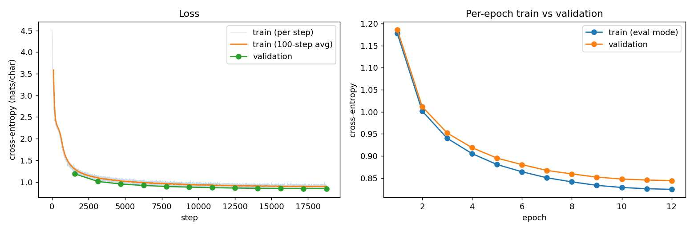
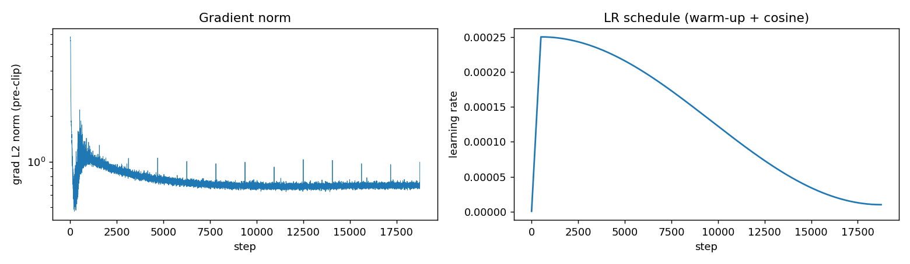

Loss curves — Anushka:

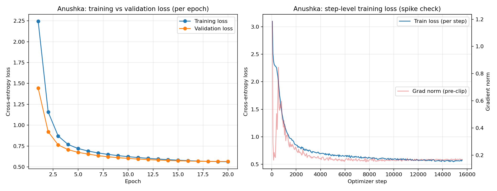

### 3.3 Failure analysis

#### Nikhil — three failure cases (greedy and T=0.9 samples from `outputs/gpt_nikhil_2L8H_B_20261001-0025/samples.txt`)

All three are from greedy decoding, where the overall repeated 4-gram rate is 0.260 (0.000 at T=0.9).

**Case 1 — Repetition / looping (prompt "Lily wanted to").**

> …The little girl was so happy that she had to be a good friend. She was so happy that she could help her mom find her toys and they were so happy.
> The little girl was so happy that she had to be careful with her friends. She was so happy that she could have a big smile on her face.
> The little girl was

- *Type:* repetition (sentence-level loop).
- *Observation:* after the first two sentences the output cycles through the same few "The little girl was so happy that she…" sentences; word-4-gram repetition inside this sample is 0.36. Greedy decoding always takes the highest-probability character, and "so happy that she" is a very high-frequency TinyStories template, so once the model is inside it nothing breaks the cycle.

**Case 2 — Loss of coherence / topic drift (prompt "One day, a big bear").**

> One day, a big bear came to visit him. He was so happy that he had to be careful with his friends.
> The little girl was so happy that she had to be a good friend…

- *Type:* loss of coherence (character identity changes).
- *Observation:* the story starts about a bear ("him", "he"), then switches to "the little girl" without any transition, and the same looped paragraphs from Case 1 appear verbatim. With a 128-character context the earlier sentences (the bear) fall out of the window, so the model continues from the nearest local context rather than the story's subject. The same looped paragraph also follows the prompts "Tom and his dog…", "The sun was hot and…" and "Once upon a time…", i.e. it acts as an attractor.

**Case 3 — Broken meaning / hallucinated content (prompt "The sun was hot and").**

> The sun was hot and said, "I want to share you too, but I want to share you too. I will be friends."

- *Type:* broken grammar / semantic nonsense plus internal repetition.
- *Observation:* the spelling and punctuation are correct (consistent with 73% next-character accuracy) but the sun is the speaker, "share you" has no object, and the clause "I want to share you too" repeats. The model learned local word and quote formation well but not semantic constraints on who can speak or what can be shared. A 2-block model has little capacity for that kind of agreement.

*What we would try:* nucleus/top-p sampling or n-gram blocking at decode time (temperature 0.9 already removes the loops: 0.000 repeated 4-grams); a longer context (≥256); and word- or BPE-level tokens.

> The same text is in `task1_llm/member_nikhil/failure_analysis.md`.

#### Anushka — three failure cases (from `task1_llm/member_anushka/failure_analysis.md`, snippets verbatim from `outputs/generated_samples.txt`, prompt "Once upon a time, ")

1. **Repetition / circular actions (T=0.5):** "She opened it and started to open it. Inside was a big box with a ball. … She was so excited to ope…". The story keeps returning to "open the box". Repeated 4-gram rate fell from 0.187 (baseline, seq 256) to 0.102 (final) but is still visible at low temperature. Proposed fix: repetition penalty, n-gram blocking or top-p sampling.
2. **Loss of coherence / entity confusion (T=1.0):** "Timmy didn't like it wild, but he told Billy, "No, Timmy, it's not yours." Billy nodded and climbed into Mia's hands." A speaker addresses himself, a new character appears, and an object does something impossible; greedy also yields "She wanted to fly it and see what was inside" for a bird. Local templates are learned, referents are not.
3. **Broken spelling and grammar at high temperature (T=1.5):** "there two friends, Mumy and Sally,gas and Sandy", "yutdent", "tonide", "DadDadonly". A flattened distribution lets low-probability characters through; at T≤1.0 spelling is essentially perfect. Distinct-n rises with temperature while quality falls, so diversity metrics alone would reward this failure.

### 3.4 Joint analysis — Task 1

- **Strengths.** Both models are numerically stable (0 non-finite steps) and generalize without overfitting (gap 0.020 and 0.040). The larger, longer-context model is clearly better at modelling: validation perplexity 1.760 vs 2.326 and top-1 accuracy 82.0% vs 73.2%. The small model is far cheaper: 211 s vs 2,573 s of training and 541 MB vs 14.8 GB peak memory, while its 2-block design reached usable perplexity with 6.6× fewer parameters.
- **Weaknesses.** Both models loop under low-entropy decoding (Nikhil greedy 0.260 repeated 4-grams; Anushka 0.102 at T=0.8–1.0) and lose track of entities. Nikhil's model has a larger gradient-norm spike (max 6.71 vs 2.26), though clipping at 1.0 kept training stable. Anushka's samples break into non-words at high temperature (T=1.5).
- **Limitations.** The comparison is not controlled: depth, width, heads, context (128 vs 512), learning rate, epochs and temperature all differ, so we cannot attribute the quality gap to any single factor. Distinct-n is computed at different temperatures (0.9 vs 0.8) and Anushka's repeated-4-gram figure is a single setting, so diversity numbers are only roughly comparable. Single seed per model; no confidence intervals. Metrics are character-level, so perplexity is not comparable to word-level LM results in [2].
- **Next steps.** Run a controlled ablation (same context length, vary depth/width one at a time); add top-p/top-k and repetition penalties and re-measure repeated 4-gram rate versus Distinct-n; try subword tokens; evaluate with a held-out story-level split and multiple seeds.

---

## 4. Task 2 — Yelp Polarity sentiment classification

All six models learn embeddings from scratch (no pretrained vectors or LMs). Data: Yelp Polarity [4], 560K train / 38K test, perfectly balanced; stratified 504K train / 56K validation split; 38K test reviews.

### 4.1 Models, architecture and hyperparameters

| Model | Member | Architecture | Key hyperparameters |
|---|---|---|---|
| B1 baseline | Nikhil | Embedding → last-token pooling → classifier | emb 128, dropout 0.30, Adam lr 1e-3, batch 128, 8 epochs, max len 256 |
| B2 | Nikhil | Embedding → 1-D CNN (k=7) → global max pool | 128 ch, dropout 0.40, AdamW lr 5e-4, wd 0.01, batch 128, 8 epochs |
| B3 | Nikhil | Embedding → BiLSTM → learned attention pooling | hidden 128/direction, dropout 0.30, AdamW lr 5e-4, wd 0.01, batch 64, 8 epochs |
| A1 baseline | Anushka | Embedding → mean pooling → 2-layer MLP | emb 128, dropout 0.30, lr 1e-3, batch 64, 10 epochs, max len 200 |
| A2 | Anushka | Embedding → 1-D CNN (k=3,4,5) → max pool | 128 ch, lr 5e-4, wd 1e-4, batch 64, 10 epochs |
| A3 | Anushka | Embedding → BiGRU → pooled state → MLP | hidden 128/direction, lr 5e-4, wd 1e-4, batch 64, 10 epochs |

Common preprocessing: lowercasing, punctuation removal, stopword removal, 30,000-word vocabulary. Nikhil keeps negation words and applies Porter stemming; seed 42; RTX 5090. Anushka: seed 3963; Tesla T4.

### 4.2 Metrics (38K test reviews)

| Model | Member | Accuracy | Macro-F1 | ROC-AUC | PR-AUC | MCC |
|---|---|---|---|---|---|---|
| B1 | Nikhil | 0.6539 | 0.6539 | 0.7207 | 0.7091 | 0.3078 |
| B2 | Nikhil | 0.9424 | 0.9424 | 0.9868 | 0.9871 | 0.8850 |
| B3 | Nikhil | **0.9538** | **0.9538** | **0.9910** | **0.9911** | **0.9077** |
| A1 | Anushka | 0.9350 | 0.9350 | 0.9813 | 0.9812 | 0.8701 |
| A2 | Anushka | 0.9426 | 0.9426 | 0.9856 | 0.9846 | 0.8851 |
| A3 | Anushka | 0.9476 | 0.9476 | 0.9865 | 0.9862 | 0.8953 |

Precision / recall (macro, weighted), calibration, size, efficiency, uncertainty:

| Model | Precision macro / weighted | Recall macro / weighted | Brier | ECE | Params | Train s | Peak MB | Examples/s (train) | Accuracy 95% CI | Hardware |
|---|---|---|---|---|---|---|---|---|---|---|
| B1 | 0.6539 / 0.6539 | 0.6539 / 0.6539 | 0.2112 | 0.0087 | 3,840,129 | 50.7 | 91.5 | 79,532 | [.6488, .6588] | RTX 5090 |
| B2 | 0.9426 / 0.9426 | 0.9424 / 0.9424 | 0.0430 | 0.0030 | 3,954,945 | 74.4 | 559.0 | 54,166 | [.9400, .9448] | RTX 5090 |
| B3 | 0.9539 / 0.9539 | 0.9538 / 0.9538 | 0.0354 | 0.0163 | 4,170,497 | 755.3 | 607.1 | 5,338 | [.9518, .9557] | RTX 5090 |
| A1 | 0.9351 / 0.9351 | 0.9350 / 0.9350 | 0.0497 | 0.0142 | 3,848,386 | 465.6 | 90.8 | 21,419 | [.9327, .9374] | Tesla T4 |
| A2 | 0.9426 / 0.9426 | 0.9426 / 0.9426 | 0.0517 | 0.0472 | 4,086,530 | 888.6 | 198.6 | 16,051 | [.9404, .9449] | Tesla T4 |
| A3 | 0.9477 / 0.9477 | 0.9476 / 0.9476 | 0.0461 | 0.0409 | 4,071,298 | 843.4 | 355.4 | 13,873 | [.9452, .9497] | Tesla T4 |

(Macro-F1 95% CIs equal the accuracy CIs to four decimals for these balanced models; MCC CIs, micro-F1, confusion matrices, slice tables and the full McNemar tables are in each member's `metrics_report.csv` and outputs folder.)

**McNemar (baseline vs experimental).** Nikhil, baseline-only-correct vs experiment-only-correct: B2 1,112 vs 12,075 (χ²=9,112), B3 811 vs 12,205 (χ²=9,972), both p < 10⁻³⁰⁰ (`outputs/sentiment_nikhil_B_20260929-1913/mcnemar.csv`). Anushka: baseline-only vs BiGRU-only 860 vs 1,340, χ²=104.29, p=1.75×10⁻²⁴ (`outputs/mcnemar_tests.csv`).

**Slice robustness.** Nikhil B3, highest error rates: has_contrast 0.0512, length >200 words 0.0494, length ≤50 0.0487 (`slice_metrics.csv`). Anushka A3: long reviews (>200 words) macro-F1 0.9071, error rate 0.0825; very short 0.0590 (`outputs/slice_robustness.csv`).

Figures — Nikhil: 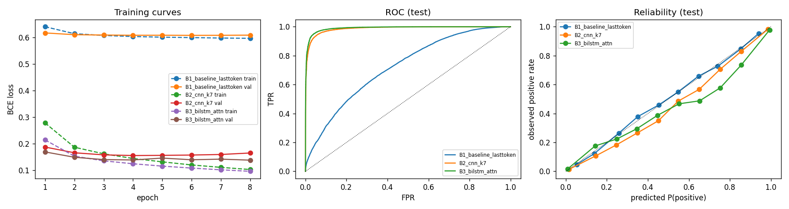 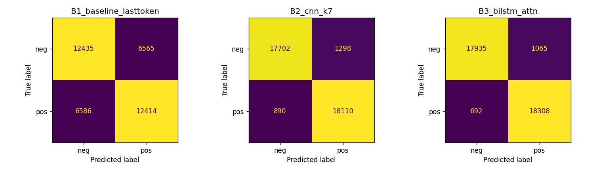 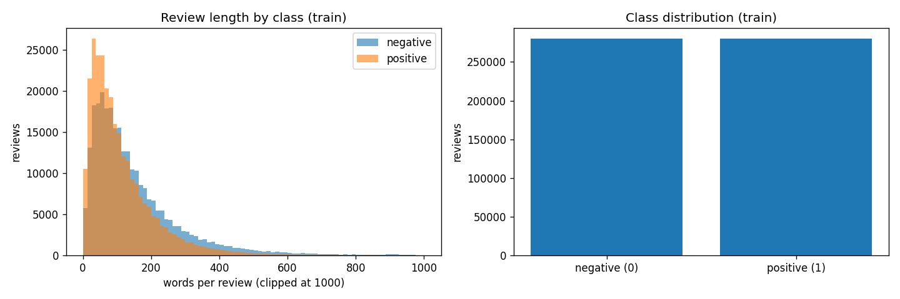
Anushka: 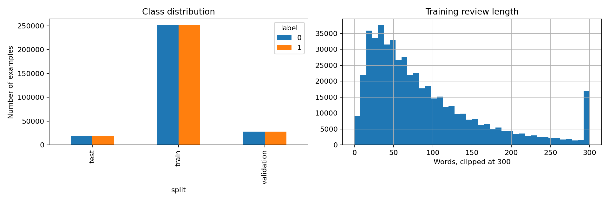 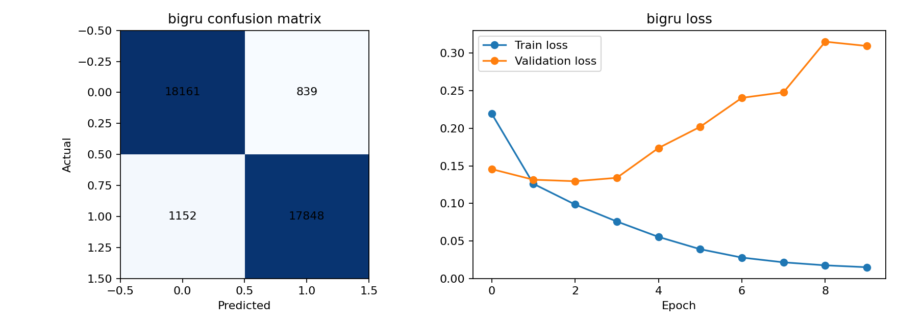

Logs: Nikhil `reproducibility/raw_logs/nikhil/task2_sentiment_nikhil_B_20260929-1913.log`; Anushka `task2_sentiment/member_anushka/logs/*_training_log.txt`.

### 4.3 Error review and failure analysis

#### Nikhil

**Recorded failed run.** The first full B3 attempt produced `nan` loss from the first step. A review whose cleaned text is empty becomes a single padding token, and the attention mask was built from `x == 0`, which masked every position so softmax returned `nan`. Fix: mask by sequence length (commit "Task 2: fix NaN in BiLSTM attention for empty reviews"); the final run has 0 non-finite steps. The raw log of the failed attempt was not kept.

**20-error review of B3** (1,065 false positives and 692 false negatives out of 38,000 test reviews; source file `outputs/sentiment_nikhil_B_20260929-1913/error_review_candidates_B3_bilstm_attn.csv`). Error types are assigned from reading each review; the label is the dataset's.

| # | Category | Review excerpt | True / pred (p_pos) | Error type | Testable fix |
|---|---|---|---|---|---|
| 1 | confident FP | "Wow love the place and everything is very clean and new! Great place… worth a try!" | neg / pos (0.9999) | Probable label noise (text is clearly positive) | Audit labels: re-label by 2 humans; measure accuracy on the cleaned set |
| 2 | confident FP | "One to two stars… Wasn't: Spicy… Had: Delicious sauce… Even BJs has a better Jambalaya" | neg / pos (0.9999) | Negation/contrast structure ("Wasn't … Had …") and comparative criticism | Keep negation scoping features; test a BiLSTM with explicit "Wasn't" handling vs current |
| 3 | confident FP | "Copper is definitely still my place, but Maharani was fine enough… Naan were all amazing" | neg / pos (0.9998) | Mixed sentiment, mostly positive words | Add a sentence-level sentiment pooling head and compare on contrast slice |
| 4 | confident FP | "The TrimTini I had was really delicious… it's not likely I will return… nice event, I enjoyed myself" | neg / pos (0.9998) | Mixed sentiment / probable label noise | Same label audit; report accuracy with ambiguous reviews removed |
| 5 | confident FP | "This was my second time dining at Company. And unfortunately, it will probably be the last…" (praise first, complaint late) | neg / pos (0.9996) | Late-reversal sentiment (positive body, negative conclusion), truncation-sensitive | Raise max length from 256 and compare error rate on >200-word slice |
| 6 | confident FN | Pharmacy review: price comparison, "Price difference is unbelievable!!… premiums are high" | pos / neg (0.0005) | Domain/lexical ambiguity (negative-sounding words about insurers, positive about the store) | Test the aspect-aware variant: pool attention only on opinion-bearing tokens |
| 7 | confident FN | "much better since they changed owners… it was terrible… horrible… Now its much better" | pos / neg (0.0005) | Temporal contrast (past negative, present positive) | Add time-contrast examples augmentation; test on `has_contrast` slice |
| 8 | confident FN | "EDIT: … Horrible service… disrespect your paying customers" | pos / neg (0.0005) | Probable label noise (review text is negative) | Label audit |
| 9 | confident FN | "Very small venue!… Plenty of great things to see, but … not a giant display" | pos / neg (0.0006) | Mild/neutral text, negative framing words ("small", "in and out in 30 minutes") | Add a neutral class check; calibrate on mild reviews |
| 10 | confident FN | "The food is crap… worst nachos… sad mess" | pos / neg (0.0007) | Probable label noise (text is clearly negative) | Label audit |
| 11 | near-threshold | "…extremely disappointed… wasted time… sales pitch" | neg / pos (0.5007) | Long review with negative content but model uncertain; truncation/length effect | Compare error vs max length (256 → 512) |
| 12 | near-threshold | "does two cuisines well… three major strengths… There are some rough spots, however" | pos / neg (0.4991) | Mixed sentiment (strengths plus caveats) | Aspect-level pooling test |
| 13 | near-threshold | "1) Hard to get in… 2) vagrant… 3) Pump system is easy to use" | neg / pos (0.5011) | Enumerated pros/cons, mixed | Same aspect-level test |
| 14 | near-threshold | "A solid two stars, yes! … food pretty good… pricey" | neg / pos (0.5013) | Mixed sentiment; rating phrase ("two stars") not seen as signal | Keep rating-number tokens in preprocessing; compare |
| 15 | near-threshold | "$49 for three rooms, ya right… would not recommend… On a positive note the techs are friendly" | neg / pos (0.5015) | Sarcasm ("ya right") plus concluding positive note | Preserve punctuation/"ya right" tokens; test a sarcasm slice |
| 16 | slice (contrast) | Las Vegas AYCE brunch, empanadas "best part", "a little under-enthused" | neg / pos (0.9996) | Mixed sentiment, contrast, long | Contrast-aware pooling / longer max length |
| 17 | slice (contrast) | Foodland: bakery "tops", "huge brownies"… | neg / pos (0.9995) | Praise of one aspect vs overall rating | Aspect-level evaluation |
| 18 | slice (contrast) | "NOTE: This was a 4-star review, but … gone down the tubes. See update below." | neg / pos (0.9995) | Update-reversal: positive body, negative update | Weight later sentences more; test a last-segment feature |
| 19 | slice (contrast) | "snobby… 2 stars only because of a young gentleman… super friendly" | neg / pos (0.9994) | Mixed sentiment; positive content about a person, negative overall | Aspect-level evaluation |
| 20 | slice (contrast) | "my husband had an omelette that was good. i had a blt, a little on the small side for $10, but bacon was great. Our server was awesome!" | neg / pos (0.9993) | Probable label noise (text is positive) | Label audit |

*Summary.* Of the 20, five are probable label noise (#1, 4, 8, 10, 20), the largest group is mixed or contrastive sentiment (#2, 3, 7, 12–14, 16, 17, 19), and the rest are late reversals / updates (#5, 18), sarcasm (#15), domain ambiguity (#6, 9) and length (#11). The single fix we would test first is a label audit of high-confidence disagreements, because it tells us how much of the remaining 4.6% error is not model error; the first model change is aspect- or sentence-level pooling evaluated on the `has_contrast` slice (error 0.0512 vs 0.0469 overall for negation).

> The same table and summary are in `task2_sentiment/member_nikhil/failure_analysis.md`.

#### Anushka

From `task2_sentiment/member_anushka/failure_analysis.md`: the CNN and BiGRU overfit (final train/val loss 0.0168/0.3057 and 0.0149/0.3097; train accuracy 0.9945/0.9951 vs val 0.9377/0.9469) while the baseline's gap is smaller (0.1257/0.1973). Long reviews (>200 words, error rate 0.0825) and very short reviews (0.0590) are the weakest BiGRU slices. Proposed testable fixes: `pack_padded_sequence`, longer max length or hierarchical chunking, validation-based early stopping, stronger regularization, keep negation/punctuation, calibration. The required 20-row review (5 confident FP, 5 confident FN, 5 near-threshold, 5 slice failures) was generated by the BiGRU in `task2_sentiment/member_anushka/outputs/error_review_20.csv`; its annotation columns (`reviewed_error_type`, `observation`, `testable_fix`) are **PENDING — empty in the repo**.

### 4.4 Joint analysis — Task 2

- **Strengths.** Every model that sees word order beats the order-free baseline, and all three non-trivial architectures of each member land between 0.935 and 0.954 accuracy. Nikhil's BiLSTM + attention (0.9538) is best overall and its interval [.9518, .9557] does not overlap Anushka's BiGRU [.9452, .9497]. The two CNNs are statistically indistinguishable (0.9424 vs 0.9426, intervals overlapping). Calibration differs: B2 has ECE 0.0030, while A2/A3 are 0.047/0.041.
- **Weaknesses.** B1 (last-token pooling) is only 0.654 accurate: the last non-pad token of a stemmed, punctuation-stripped review carries little sentiment, so it is a deliberately weak floor, not a competitive baseline. The BiLSTM is ~10× slower to train than the CNN for a 1.1-point gain. Both strongest models fail on mixed/contrastive reviews and long reviews.
- **Limitations.** The two members used different max lengths (256 vs 200), epochs (8 vs 10), batch sizes, preprocessing (negation kept and stemming vs not stated for Anushka), seeds and GPUs (RTX 5090 vs T4), so training time and part of the accuracy gap are not comparable; we cannot say BiLSTM beats BiGRU in general. A fraction of the apparent "errors" appear to be label noise. The manual error reviews are not complete for Anushka.
- **Next steps.** Retrain all six models under one shared protocol (length, epochs, batch, seed, preprocessing); add early stopping on validation loss (Anushka's models overfit); test aspect/sentence-level pooling and longer contexts for the contrast and long slices; run a label audit on confident disagreements; complete the manual reviews.

---

## 5. Task 3 — CycleGAN (Monet ↔ photo)

Domain A = Monet paintings (300 images), domain B = photographs. Both members use ResNet generators, 70×70 PatchGAN discriminators, LSGAN, cycle weight 10 and identity weight 5 as in [3]. Metrics are computed on 1,000 held-out photos and the 300 Monet paintings.

### 5.1 Architecture and hyperparameters

| Item | Nikhil (B) | Anushka (A) |
|---|---|---|
| Generators | 9 residual blocks, 32 base channels, 2.85M each | 9 residual blocks, 64 base channels, 11.38M each |
| Discriminators | 70×70 PatchGAN, 64 ch, 2.76M each | 70×70 PatchGAN, 64 ch, 2.76M each |
| Total parameters | 11,230,600 | 28,285,832 |
| Training resolution | 128 px (resize 143, random crop, flip) | 256 px (resize 286, random crop, flip) |
| Optimizer / schedule | Adam 2e-4, β (0.5, 0.999), 25 constant + 25 decay epochs, history pool 50 | same |
| Batch / epochs / seed | 1 / 50 / 7 | 1 / 50 / 3963 |
| Hardware | RTX 5090 | RTX 4090 |

### 5.2 Metrics (both directions)

| Member | Direction | FID | KID | Precision | Recall | Density | Coverage | Cycle L1 | LPIPS (translation) | Content cos. |
|---|---|---|---|---|---|---|---|---|---|---|
| Nikhil | A→B | 88.71 | 0.0272 | 0.753 | 0.356 | 0.727 | 0.448 | 0.0477 | 0.388 | 0.698 |
| Nikhil | B→A | 89.87 | 0.0175 | 0.571 | 0.623 | 0.554 | 0.920 | 0.0551 | 0.344 | 0.689 |
| Anushka | A→B | 81.16 | 0.0163 | 0.740 | 0.469 | — | 0.554 | 0.0345 | 0.338 | 0.792 |
| Anushka | B→A | 88.58 | 0.0143 | 0.504 | 0.643 | — | 0.897 | 0.0467 | 0.385 | 0.741 |

Reference FID of untranslated inputs: Nikhil ≈126.0, Anushka 122.7. Anushka's density values are in her `full_metrics_report.csv`. Nikhil's final-epoch training losses: cycle A/B 0.0922/0.0898, identity A/B 0.0614/0.0763, G adversarial A→B/B→A 0.5116/0.9311, D_A/D_B 0.0228/0.1479; LPIPS input-vs-reconstruction 0.257 / 0.156.

| Efficiency, stability, leaderboard | Nikhil (B) | Anushka (A) |
|---|---|---|
| Training time / throughput | 27,580 s / 22.70 img/s | 22,507 s / 26.84 img/s |
| Peak training memory | 464 MB | 9,974 MB |
| Non-finite steps | 0 | 0 |
| Course-script FID A→B / B→A | 108.34 / 107.72 | 98.75 / 95.02 |
| Course-script MiFID A→B / B→A | 0.4216 / 0.4043 | 0.4150 / 0.4045 |
| Submission FID / MiFID (avg) | 108.032 / 0.4129 | 96.886 / 0.4097 |
| Kaggle public score | −54.2222 (6 Oct 2026) | −48.6479 (2 Oct 2026), **team rank 21** |

Leaderboard context on 6 Oct 2026 (50 teams): top −39.78, rank 10 at −46.99, rank 20 at −48.50. Rank 21 maps to 8 bonus points in the rubric table. The submission is the direct inference output of each member's own CycleGAN; Inception and LPIPS networks are used only as fixed measuring instruments. Course-script FID/MiFID is the first 300 real vs 300 generated images, both directions averaged (`evaluate_local.py`). Evidence: Nikhil `task3_gan/member_nikhil/{full_metrics_report.csv, submission.csv, submission_course_script.csv}`, Anushka `task3_gan/member_anushka/{full_metrics_report.csv, submission.csv}`.

Figures — Nikhil loss curves (LSGAN adversarial, cycle/identity L1, gradient norms, total generator loss) and epoch-50 samples (rows: Monet input, A→B translation, reconstruction; then photo input, B→A translation, reconstruction):

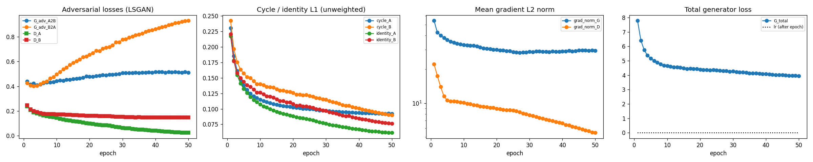
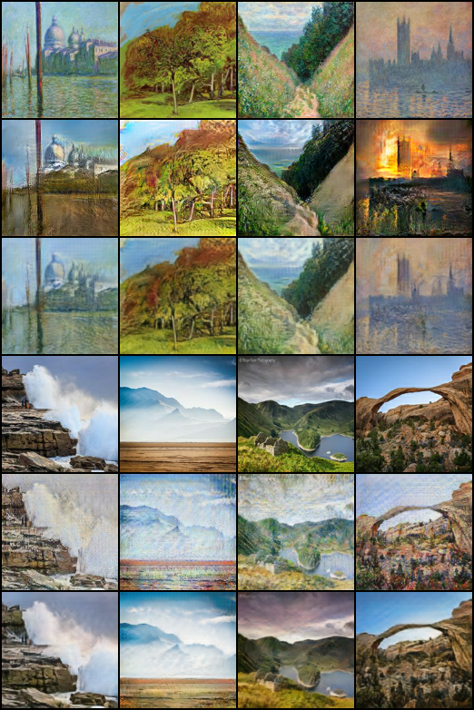

Anushka:

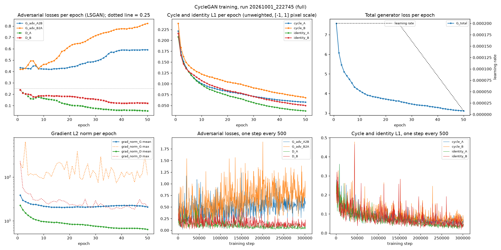
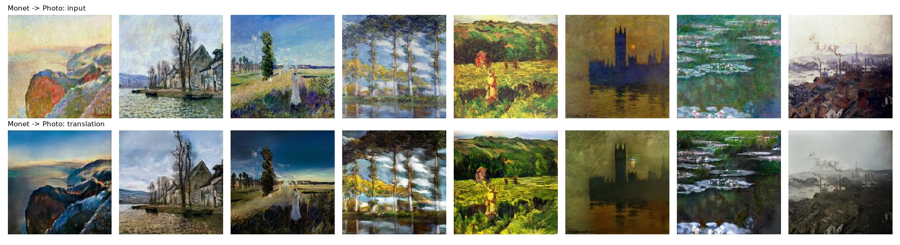
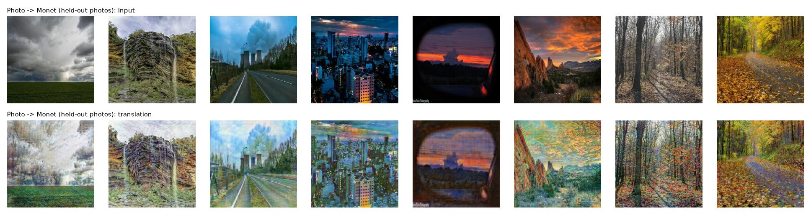
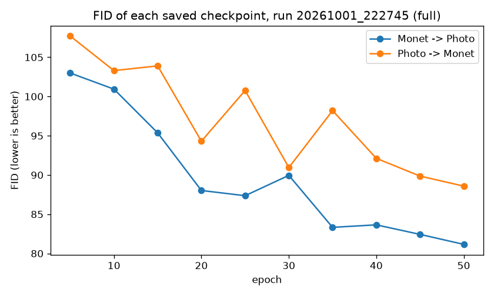

### 5.3 Analysis and failure cases

#### Nikhil

- **Visual quality** (epoch-50 sample sheet). Photo→Monet (B→A) clearly shifts to a painterly palette and soft brush texture on coastlines, hills and arches, but flat regions such as sky pick up a fine grid / streak pattern. Monet→photo (A→B) mainly makes colours and lighting more photographic and keeps the composition, but the paintings' brush texture survives in places (the output still looks like a recoloured painting), and one scene (a fire-coloured sky over a building) shows invented orange content that is not in the input. Reconstructions are close to the originals in layout and colour.
- **Cycle consistency and stability.** Cycle L1 is 0.0477 (A→B) and 0.0551 (B→A) and fell steadily from 0.23/0.24 in epoch 1 to 0.092/0.090 (training) with no divergence. Identity losses also fell (0.061/0.076). Generator gradient norm settled near 29 and the discriminator's fell from 22 to 5.5; 0 non-finite steps. The adversarial curves show an imbalance: D_A (Monet discriminator) loss fell to 0.023 and the photo→Monet generator's adversarial loss rose from 0.43 to 0.93, i.e. the Monet discriminator slowly wins with only 300 paintings, the same pattern as in Anushka's run.
- **Direction asymmetry.** A→B has higher precision (0.753) but low recall/coverage (0.356/0.448); B→A has the opposite (0.571 / 0.623, coverage 0.920). The generator producing photos gives realistic but less diverse images; the one producing paintings is more diverse but less often on the real Monet manifold.
- **Shortcomings.** FID improves only from ≈126 (untranslated) to ≈89, the 128-px training resolution and 32-channel generator limit detail, and KID is higher than Anushka's in A→B (0.0272 vs 0.0163). Per-image failure examples are not yet analysed by image name.
- **Next.** Train at 256 px; add discriminator augmentation for the 300-painting domain; replace transposed convolutions with upsample + convolution to remove the grid.

> The same analysis is in `task3_gan/member_nikhil/failure_analysis.md`.

#### Anushka (from `task3_gan/member_anushka/failure_analysis.md`, selected by score, not by eye)

1. Photo→Monet: repeating grid and streaks over flat regions (highest cycle L1, 0.195 and 0.175 vs mean 0.047).
2. Photo→Monet: dark and saturated photos are washed out (content cosine 0.330 / 0.406 vs mean 0.741); the 300 paintings are mostly bright/pastel.
3. Monet→Photo: hazy paintings get invented content (content cosine 0.538–0.628 vs mean 0.792).
4. Monet→Photo: brush strokes survive in heavily textured paintings (cycle L1 0.058–0.066 vs mean 0.034).
5. Training: the discriminators pull ahead (D_A loss 0.239→0.053; photo→Monet adversarial loss 0.42→0.82); FID per checkpoint is non-monotonic (94.3 at epoch 20, 100.8 at 25, 98.2 at 35, 88.6 final).
Images: `outputs/full_run_20261001_222745/failure_candidates_*.jpg`. Proposed: discriminator augmentation, upsample+conv, lower identity weight.

### 5.4 Joint analysis — Task 3

- **Strengths.** Both CycleGANs trained stably for 50 epochs with 0 non-finite steps and improved FID well below the untranslated baseline (≈126 / 122.7 → ≈89 / 81–89). Anushka's wider, 256-px model is better on most image-quality numbers: FID A→B 81.16 vs 88.71, cycle L1 0.0345 vs 0.0477, content cosine 0.792 vs 0.698, and the Kaggle score −48.65 vs −54.22. Nikhil's model is 2.5× smaller (11.2M vs 28.3M), uses 464 MB instead of 9.97 GB of memory, and reaches a similar B→A FID (89.87 vs 88.58).
- **Weaknesses.** Both show the same signature: the Monet discriminator overpowers the photo→Monet generator, giving grid/streak artifacts on flat regions and low photo→Monet precision (0.571 and 0.504). Dark, saturated photos and hazy paintings are the hardest inputs for Anushka's model. Nikhil's A→B recall is low (0.356).
- **Limitations.** The runs differ in resolution (128 vs 256), width and GPU, so the two cannot be compared as a controlled experiment; Course-script scores use only the first 300 images. KID/FID with 300 Monet images is noisy, and there is a single seed. No human audit was performed, so perceptual claims rest on automated metrics and our own inspection. The team rank (21 of 50) is below the top 20.
- **Next steps.** Train Nikhil's model at 256 px (isolates resolution from width); add DiffAugment-style discriminator augmentation; replace transposed convolutions; lower identity weight for stronger style change; use the top-checkpoint-by-FID rather than the last epoch.

---

## 6. Reproducibility

- Root `README.md` documents setup, per-member run commands and where each result lives; runs are config-driven (`src/configs/*.yaml` for Nikhil, `src/config.json` for Anushka).
- Every run has a raw log (`reproducibility/raw_logs/`) and a manifest with package versions (`reproducibility/manifests/`); Nikhil's include smoke tests. Per-member requirements: `reproducibility/manifests/task*_anushka_requirements.txt`, root `requirements.txt`.
- Hardware disclosed: Nikhil NVIDIA RTX 5090 for all runs (PyTorch 2.8.0, CUDA 12.8); Anushka RTX 5090 (Task 1), Tesla T4 (Task 2), RTX 4090 (Task 3) as recorded in her results files and manifests.
- Model checkpoints are tracked with Git LFS.

## 7. Open items before submission

1. **Task 2 error reviews** — Nikhil: re-read the §4.3 table against the full reviews. Anushka: fill the 20-row `error_review_20.csv`.
2. **Nikhil's `results.md` "why" paragraphs (Tasks 1–3)** — his own design rationale; not written here because it records his intent. His `failure_analysis.md` files are now filled in.
3. **Kaggle** — record final public/private scores and rank on deadline day.
4. **Team number and PDF** — export this file to `report/DATA266_Lab1_Report_Team_42.pdf` (the repository link is above).

## References

1. A. Vaswani, N. Shazeer, N. Parmar, J. Uszkoreit, L. Jones, A. N. Gomez, Ł. Kaiser and I. Polosukhin. *Attention Is All You Need.* NeurIPS 30, 2017. arXiv:1706.03762. https://arxiv.org/abs/1706.03762
2. R. Eldan and Y. Li. *TinyStories: How Small Can Language Models Be and Still Speak Coherent English?* arXiv:2305.07759, 2023. https://arxiv.org/abs/2305.07759
3. J.-Y. Zhu, T. Park, P. Isola and A. A. Efros. *Unpaired Image-to-Image Translation using Cycle-Consistent Adversarial Networks.* ICCV 2017. arXiv:1703.10593. https://arxiv.org/abs/1703.10593
4. Yelp Polarity dataset (`fancyzhx/yelp_polarity`). https://huggingface.co/datasets/fancyzhx/yelp_polarity
5. DATA 266 Fall 2026 GAN Image Style Transfer, Kaggle class competition. https://www.kaggle.com/competitions/data-266-fall-2026-gan-image-style-transfer
