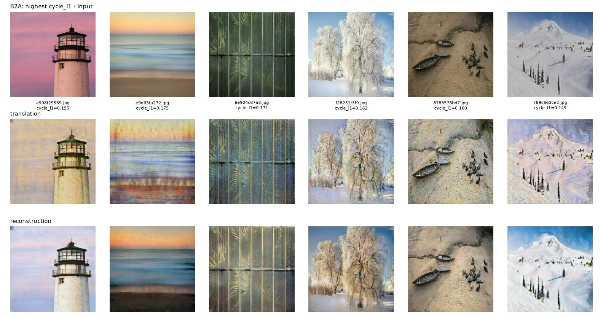
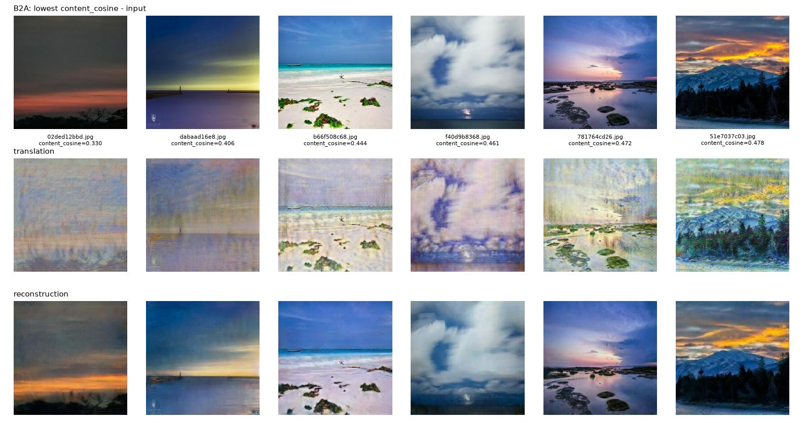
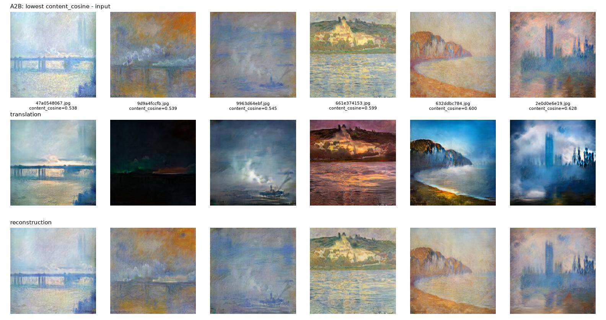
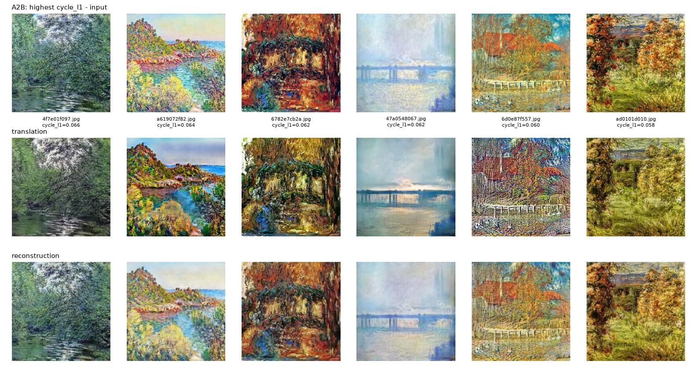

# Failure / Error Analysis — Task 3 — CycleGAN Style Transfer

**Member:** anushka

<!-- Draft written from the evidence of run 20261001_222745. To be rewritten in my own words before submission. -->

The cases below were picked by score, not by eye: the images with the highest cycle-reconstruction L1 and the lowest content cosine in each direction (`outputs/full_run_20261001_222745/per_image_scores.csv`). Each figure shows input, translation and reconstruction.

## 1. Photo -> Monet: regular texture pattern over flat regions

- **What happens:** smooth areas (sky in `a908f29569.jpg`, the blurred sea in `e9d65fa272.jpg`) are covered with a repeating fine grid and vertical streaks instead of brush strokes. The pink sky of the lighthouse turns pale yellow.
- **Evidence:** these are the highest cycle L1 values in this direction (0.195 and 0.175, against a mean of 0.047).
- **Likely cause:** the Monet discriminator judges 70x70 patches and rewards any high-frequency texture, and a flat photo region gives the generator no structure to place strokes on. Transposed convolutions are also known to produce periodic patterns.

## 2. Photo -> Monet: dark and saturated photos are washed out

- **What happens:** night and sunset photos (`02ded12bbd.jpg`, `dabaad16e8.jpg`) become pale, low-contrast images in which the scene is hard to recognise.
- **Evidence:** lowest content cosine in this direction (0.330 and 0.406, against a mean of 0.741). The reconstructions recover the dark scene, so the information is hidden in the translation rather than lost.
- **Likely cause:** the 300 Monet paintings are mostly bright and pastel, so the generator moves every image towards that palette. The discriminator has almost no dark paintings to accept.

## 3. Monet -> Photo: hazy paintings get invented content

- **What happens:** foggy, low-detail paintings (`9d9a4fccfb.jpg`, `2e0d0e6e19.jpg`) turn into near-black night scenes or dramatic blue skies that are not in the painting.
- **Evidence:** lowest content cosine in this direction (0.538 to 0.628, against a mean of 0.792).
- **Likely cause:** real photos are sharper and have more contrast than these paintings, so the generator adds contrast and detail that the input does not contain.

## 4. Monet -> Photo: brush strokes survive

- **What happens:** heavily textured paintings (`6782e7cb2a.jpg`, `6d0e87f557.jpg`, `ad0101d010.jpg`) keep their strokes; the output looks like a recoloured painting, and `6d0e87f557.jpg` gains a noisy mesh pattern.
- **Evidence:** highest cycle L1 in this direction (0.058 to 0.066, against a mean of 0.034).
- **Likely cause:** removing thick strokes would change many pixels, which the cycle and identity losses penalise, so the generator keeps them.

## 5. Training: discriminators pull ahead of the generators

- **What happens:** D_A loss falls from 0.239 to 0.053 and the Photo -> Monet adversarial loss rises from 0.42 to 0.82 over the run ([loss_curves.png](outputs/full_run_20261001_222745/loss_curves.png)).
- **Evidence:** Photo -> Monet FID per checkpoint is not monotonic (94.3 at epoch 20, 100.8 at epoch 25, 98.2 at epoch 35) before it settles at 88.6.
- **Likely cause:** with only 300 paintings the Monet discriminator can memorise them. Precision for Photo -> Monet is 0.504, the lowest of the four precision/recall values, which fits generated paintings that fall outside the real Monet set.

## 6. Runs that were stopped

- `20261001_202102`: 128px run on another machine, stopped at epoch 1.
- `20261001_220908`: 256px run without torch.compile, stopped in epoch 1 because it needed about 8.5 hours. Restarted as `20261001_222745` with the compiled training step.

## What I would try next

- Augment the discriminator inputs so the Monet discriminator cannot memorise 300 paintings.
- Replace the transposed convolutions with upsampling followed by a convolution, to remove the grid pattern.
- Lower the identity weight to allow a stronger style change in Monet -> Photo.
